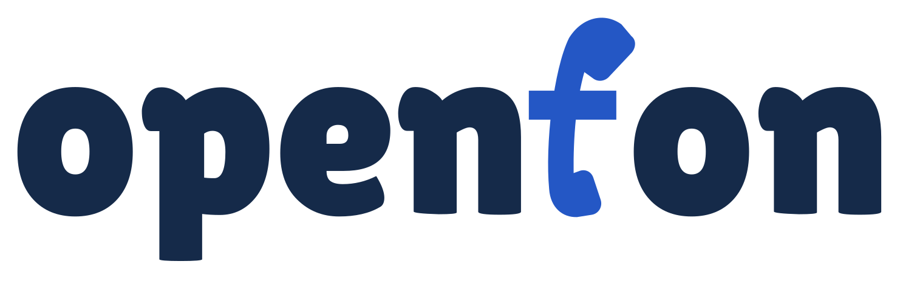

# OpenFon — chosen logo

Status: **Approved by Cristian on 2026-09-27.** This is the definitive logo selection for future OpenFon branding work.

## Canonical artwork

- [SVG master](lilita-f-variants/4-straighter-stem-tight-spacing.svg)
- [PNG preview on white](lilita-f-variants/4-straighter-stem-tight-spacing.png)

Use this exact SVG as the source of truth. It contains outlined paths and needs no runtime font installation.

## Approved design

- Lowercase **openfon**, set in **Lilita One Regular**.
- A blue telephone handset replaces the **f**: variant **4, Straighter stem**, with a compact lower end, 5° clockwise handset tilt, and horizontal crossbar.
- The final spacing correction moves the trailing **on** 6 SVG units left, closing the f–o gap while preserving the o–n spacing. The earlier `4-straighter-stem.svg` lacks this approved correction.
- Navy lettering `#152a49`, blue handset `#2457c5`.
- Preserve the approved outlines, proportions, tilt, and spacing. Ordinary product copy remains “OpenFon”.

The user selected variant 4, requested the narrower f–o gap, then explicitly approved the corrected result: “I love this one. Please set it up in memory and tell the other agents in this project that this is the chosen logo.”

Lilita One license material is retained under [identity/assets/fonts/](identity/assets/fonts/).

## Integration status

The chosen logo has been applied to the local app assets in `web/public/brand/`, the favicon and social card. The [identity kit](identity/README.md) implements the wider first brand direction, visual book, voice guide, fonts and tokens. The application now follows the selected identity book, with Lilita One short headings and locally bundled Nunito Sans reading text. Existing provider defaults and product safety contracts are retained. No production deployment has been performed as part of this identity work.

## Historical explorations

Older exploration artwork is historical and superseded by this selection, including the open-loop mark, rotary-phone and handset cord/script concepts, the original Avenir handset-f, generated alternatives, neutral and sculpted typography studies, the four-font comparison, and the first three handset variants. Do not treat their older recommendations or “current concept” labels as current brand guidance.
